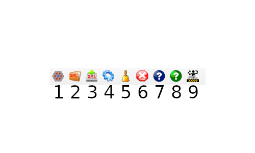
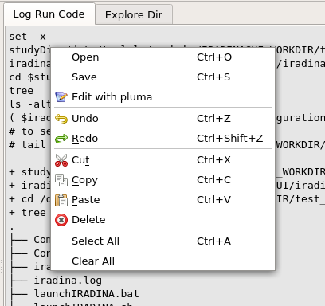

.. include:: ./rst_prolog.rst

|solverlabgui| main widget
==========================

The main window of |solverlabgui| is composed of three parts:

#. The toolbar_ , at the top. It is used to perform quick actions.
#. The `tree view`_ , at the left. It is used to import and modify data.
#. The `content tab`_ , at the center/right. Its role is detailed below.

.. _toolbar:
   
The toolbar
-----------

This toolbar contains icons related to actions, from left to right:

#. new |solverlab| data: create a |solverlab| case from scratch
#. load |solverlab| data: load a previously saved case, serialized in an ``xml`` file
#. save |solverlab| data: save current the |solverlab| case, serialized in an ``xml`` file
#. launch |solverlab| computation
#. refresh the `tree view`_
#. clear |solverlab| data model, remove |solverlab| data tree (in ``SolverlabObject`` widget)
#. open |solverlabgui| documentation (i.e. the present documentation)
#. open `SOLVERLAB <https://github.com/ndjinga/SOLVERLAB>`_ documentation
#. load an example in |solverlabgui|. Open the directory of built-in examples.

.. _tree view:

The tree view
-------------

The tree view allows to see and modify the content of |solverlab| data.

Modify tree view items' values
+++++++++++++++++++++++++++++++++++++

There are some values as leaves of tree. Names and tooltips are *almost* as |solverlab| code naming usage.

#. **Simple scalar values**.
   User can modify value on *left-double-click*, selecting tree item
   nodes **hovering column value**.
#. **Other specific values**.
   User can modify value on *right-click*, to get a contextual menu for
   modification, selecting tree item nodes **hovering columns name and value**.
   
.. note:: Some values are context specific and can be displayed only when they are needed.

Tree view widget menus
++++++++++++++++++++++

There are some menus, as *contextual menu* on *right-click* when selected
tree item nodes. Some menu are generic, and other are specific to nodes, such as
contextual actions.

Expand/collapse menu
++++++++++++++++++++

.. image:: images/solverlabExpandMenu1.png
   :scale: 80 %
   :align: center

Expand or collapse all or selected part of data tree. To activate this menu,
*right-click* on **head of arrow** of tree item nodes (at
**left** of item's icon).

Delete/Insert menu
++++++++++++++++++

Insert, delete and reset all or selected part of the data tree. To activate this
menu, *right-click* on 'name' of tree item nodes (at right
of item icon). The concerned items are usually not leaves (i.e. items without a
value).

.. _content tab:
  
The content tab
---------------

Log Run Code widget
+++++++++++++++++++

This widget displays a log of |solverlab| execution.

|solverlab| code is executed when clicking the *Launch solverlab calculus*
button in the toolbar_.

.. image:: images/solverlabLogRunCodeWidget1.png
   :scale: 80 %
   :align: center

Log Run Code widget menu
~~~~~~~~~~~~~~~~~~~~~~~~

Display, **and** edit the current log. To activate this menu, *right-click* anywhere in Log Run Code widget.

.. note:: By using *Open* and *Save* actions in this menu,this widget can be
          used  as an elementary text file viewer/editor.

Other File widget
+++++++++++++++++

This widget displays the content of the selected ``.med`` file, using the ``MEDCoupling`` API.

By right clicking on the ``fileMed`` field, in the `tree view`_, the content
of the file can be dumped to ASCII format by clicking on ``Dump ascii content`` context menu.
