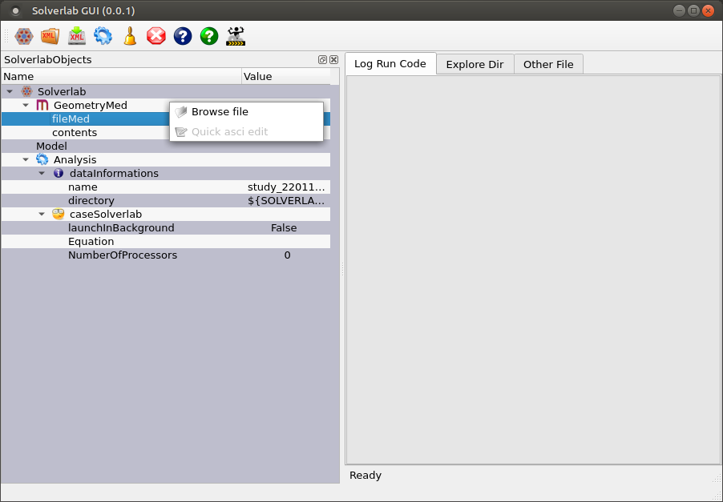
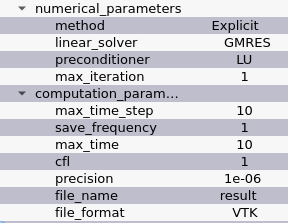
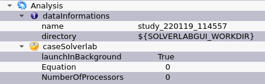
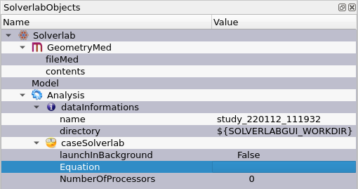
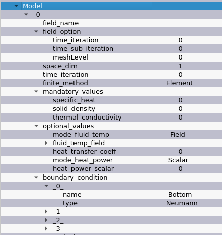

.. include:: ./rst_prolog.rst

Usage
=====

Create a new *SOLVERLAB tree* by clicking on the first item of the toolbar, in
red on the picture below:

Right click on the ``fileMed`` field to import the ``.med`` to study.

    
Then, right click on ``Model`` to choose the physical model to apply.

.. image:: images/guitips3.png
    :align: center

.. note:: Not all model are yet implemented in the GUI.

The data of the model can now be freely modified.
             
Models have ``computation_parameters`` and ``numerical_parameters``.

 
``file_name`` is the name of the result file produced by |solverlab|, at the end of the simulation. 

To launch the simulation, go to the ``Analysis`` section of the tree view.
Before launching the simulation, check ``Analysis`` to select how to launch the simulation.

``name`` under ``Analysis/dataInformations`` is the directory name where the result file will be stored. 

Two launch modes are available. The ``foreground`` mode freezes the GUI until
the computation ends. The ``background`` mode runs the simulation as a background
process, and let the GUI running.

Model
-----

This section explains the options of the ``Model`` section of the Tree Object.

The |solverlab| Tree Object is composed of several parts:

* ``GeometryMed``

    * ``fileMed``: the ``.med`` file to work on (it can be imported by right-clicking and select ``Browse file``)
    * contents: read the selected file and display some important information about its content

* ``Model``
    * the list of models (right-click to add one)
* ``Analysis``
    * ``datainformations``
        * ``name``: name of the directory the study is saved
        * ``directory``: location of the base directory of |sovlerlabgui|
    * ``caseSolverlab``
        * ``launchInBackground``: wether to launch the computation as a
          background job. More information can be found here `here <background_>`_ 
        * ``Equation``: which equation to solve, from the list of models
        * ``NumberOfProcessors``: if in background try to launch |solverlab| in multicore

Diffusion Equation
++++++++++++++++++

The documentation for this equation can be found `here <SolverlabDiffusion_>`_

A field need to be present in your mesh file, in order to be visible in the ``Tree Object``. The ``field_option`` are advanced configurations, it is recommended to leave them to their default value.

Some values can be the name of a field of a mesh file or a scalar. The GUI let you choose between those two options. 

The boundary condition are created dynamically from the content of the ``.med`` file.

.. background::

Background
----------

When a simulation is launched in background, it allows to replay the computation later. Moreover, it avoids freezing the GUI.
The simulation's configuration is serialized as an ``xml`` file, stored in the output
directory. The mesh can also be copied, in order for the output directory to be
a standalone study, compatible with the direct use of |solverlab|.

When a case is launched, a ``bash`` script is generated. This script notably set the shell environment of the computation, allowing to easily launch the computation again later. 

A ``Python`` file is also copied from ``PACKAGESPY``. This file is needed in order to launch the simulation again.
It can be modified locally, in order to change the computation's parameters.
